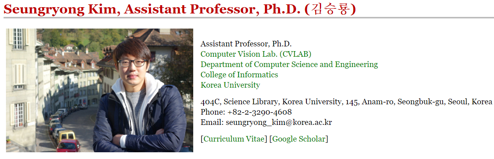

# ComputerVision_Basic

------

## 1. Lecture

I already get lecture "Machine Learning Application" in Korea University by Prof. Seungryong Kim. I have my utmost respect for professor, and I want to follow the examples of professor, because of many teaching about lecture and except lecture.

So I want to summary this class in my github repository due to memorize my lecture.

- [Prof. Seungryong Kim's page](https://seungryong.github.io/)
- [Youtube Lecture (Prof. Seungryong Kim)](https://www.youtube.com/playlist?list=PLCNc54m6eBRWz3tmkBPJAIdkSn6vFhtgR)

------

## 2. Rule

> To understand more easily, write my note using Korean.

------

## 3. Study Procedure

1. Understand lots of computervision's concept and Study
2. Memo in markdown file with picture which help to understan more easily
3. make code myself using tensorflow or pytorch

------

## 4. Contents

1. CNN basic
2. [AlexNet](note/02_AlexNet.md)
3. [VGGNet](note/03_VGGNet.md)
4. [GoogleNet](note/04_GoogleNet.md)
5. [ResNet](note/05_ResNet.md)
6. [Semantic Segmentation](note/06_Semantic_Segmentation.md)
7. [Classification & Localization](note/07_Classification_Localization.md)
8. [Object Detection](note/08_Object_Detection.md)
   1. [R-CNN, Fast R-CNN, Faster R-CNN](note/08_Object_Detection(R-CNN_all).md)
   2. [YOLO](note/08_Object_Detection(YOLO).md)
   3. [Mask R-CNN](note/08_Object_Detection_instance_segmentation.md)
9. [Generative Adversarial Networks (GAN)](note/09_GAN.md)
10. [Representation Learning.md](note/10_Representation_Learning.md)

------

## 5. Additional Content

- [ ] [Improving ResNet : Densly Connected Convolutinoal Networks](note/05_ResNet.md)
- [ ] [Improving ResNet : Squeeze-and-Excitation Networks](note/05_ResNet.md)
- [ ] [Deconvoultional Network](note/06_Semantic_Segmentation.md)
- [ ] [Classification & Localization : 자세히 들여다보기](note/07_Classification_Localization.md)
- [ ] [YOLO Network Design Review](note/08_Object_Detection(YOLO).md)
- [ ] [BigGAN](note/09_GAN.md)
- [ ] [Explosion of GAN](note/09_GAN.md)
- [ ] [Scene Graphs to GAN](note/09_GAN.md)
- [ ] [Represenataion Learning 전체](note/10_Representation_Learning.md)