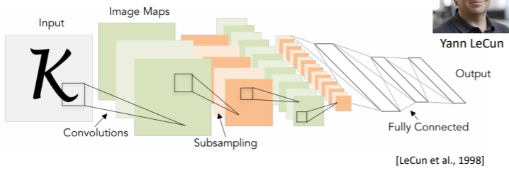
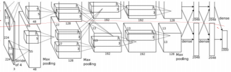
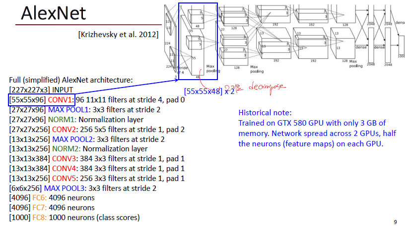

# AlexNet

## Review : LeNet-5

LeNet의 경우는 실제로 Convolutional Neural Network를 적용한 사례이다. Conv Filter와 subsampling을 통해서 CNN 아키텍쳐를 구성하였다.

실제로 ImageNet 대회에서 그 전까지는 SVM이 주로 성능이 제일 좋은 것으로 알려져있었으나, CNN의 등장으로 이미지 분야는 딥러닝이 독점한다.

## 1. AlexNet

### 1-1. 특징

- parameter : LeNet은 6만개의 parameter, AlexNet은 6천만개의 parameter를 사용
- Activation Function : LeNet은 Tanh, AlexNet은 ReLU
- DropOut의 등장
- 2개의 아키텍쳐를 놓음으로써 GPU 병렬계산을 가능하게끔 하였다.
- 2개의 아키텍쳐가 conv3, FC6, FC7, FC8에 서로 교차함으로써 2개의 GPU를 병렬해도 성능이 괜찮다는 것을 증명
- Local Response Normalization : 활성화된 뉴런이 주변을 억제시키는 행동. 주변보다 엄청 활성화되어있다면 돋보일 것이고, 주변도 같이 돋보인다면 normalization을 통해 억제한다. (주변보다 엄청 활성화되어있다면 이는 classification 문제에 있어 중요한 feature를 의미)

### 1-2. Conv1 Parameter

- input : 227 * 227 * 3
- Filter : window : 11 * 11 * 3 // channel : 96
- output : 55 * 55 * 96
- parameter : 11 * 11 * 3 * 96 = 35K
- bias : 96

> window size 만큼 filter가 96개 있기 때문에 parameter는 (window_size x channel 수)

### 1-3. GPU 병렬분산

위의 그림을 보면 input을 통해 첫 CONV1 layer를 거치면 55X55X96의 dimension을 가진다. 이 때, channel은 96개이며, 이를 2개로 나누어 55X55X48을 각각의 GPU로 병렬분산하여 쓴다.