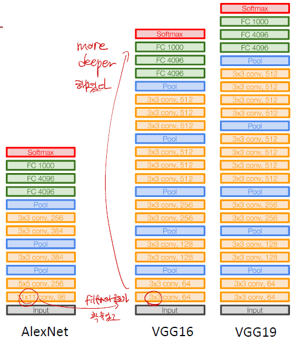
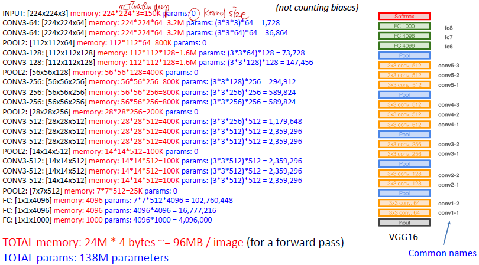
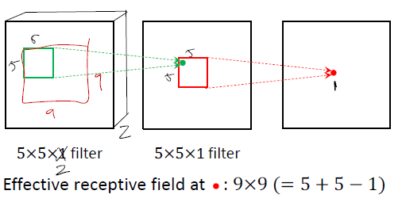
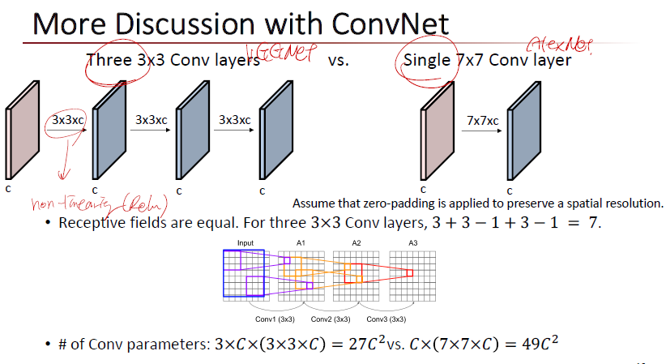

# VGGNet

--------

## 1. Concept

> _**Small Filter & Deeper Networks**_

1. _**filter을 좀 더 smaller한 filter를 적용하였다.**_ : 7 * 7 → 3 * 3
2. AlexNet은 8개의 layer를 쌓고, _**VGGNet은 16-19 layer를 쌓는다.**_ : Model이 Deep Learning이라는 수식이 붙을 정도로 깊어졌다.
3. _**Data Augmentation 적용**_ : Deep Learning의 단점 중 데이터가 적으면 성능이 안나오는 부분을 보완

### 1-1. Architecture

1. 대부분의 메모리는 CONV layer에 해당한다. (아직 layer를 많이 거치지 않을 때라 다루는 숫자가 크다.)
2. 대부분의 parameter 는 Fully Connected Layer에 해당한다.

--------

## 2. Receptive Field

> _**하나의 output을 만들기 위해 주변 pixel들이 몇 개정도 영향을 주는가?**_

위의 그림을 보면 9X9의 그림을 2개의 layer를 거쳐서 하나의 output으로 만드는 작업을 하기 위해서는 filter를 어떤 크기로 가져야할까? 에 대한 질문에 답을 하는 것이 receptive field라고 보면 된다.

--------

## 3. AlexNet vs VGGNet

receptive field는 7X7로 동일하다고 가정하였을 때,

1. 3X3 layer를 3번 쌓을 것인가?
2. 7X7 layer를 1번 쌓을 것인가?

이 질문에 VGGNet의 핵심이 들어가있다.

3X3 layer를 3번 쌓았을 때 parameter의 갯수는 filter의 갯수 (3 X 3 X C), 3 layer의 3, 같은 포인트를 찍는 output의 갯수는 channel의 깊이,C를 곱해서 $27C^2$

7X7 layer를 1번 쌓았을 때 parameter의 갯수는 filter의 갯수 (7 x 7 x C), 같은 포인트를 찍는 output의 갯수 channel의 깊이 c,를 곱해서 $49C^2$ 개 이다.

--------

## 4. VGGNet 장점

1. Layer를 여러개를 쌓아서 non-linearty function을 여러번 쌓는다. 따라서 모델을 딥하게 쌓았으므로 표현력이 다른 architecture 보다 좋아졌다.
2. parameter의 갯수가 현저히 줄었다. 같은 성능을 내는 모델도 훨씬 적은 갯수로 훈련이 가능하였다.

----------

## Reference

1. [VGGNet code 및 architecture 영어설명](https://www.programmersought.com/article/6413685268/)
2. [VGGNet Architecture 한글설명](http://aikorea.org/cs231n/convolutional-networks/)