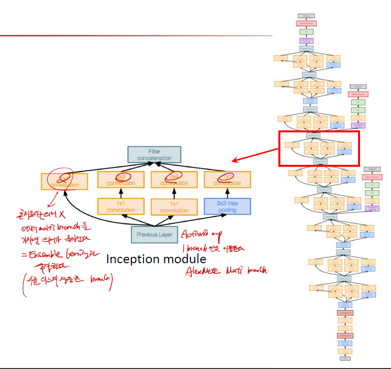
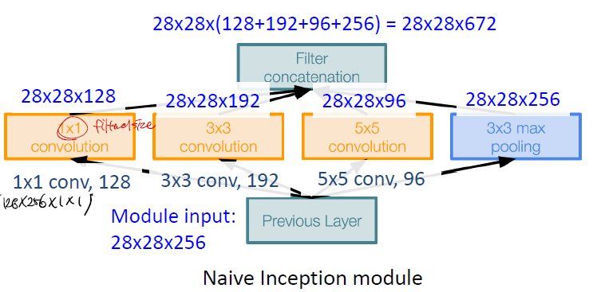
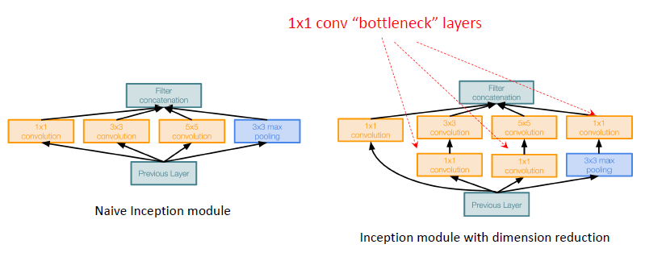
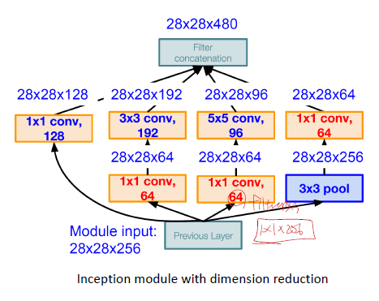
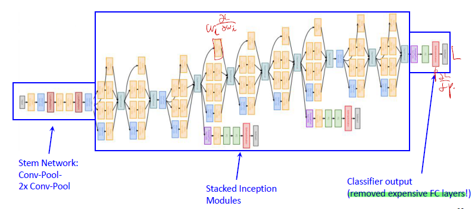
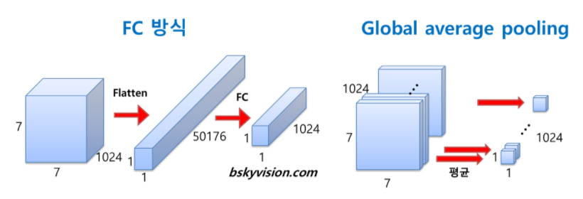
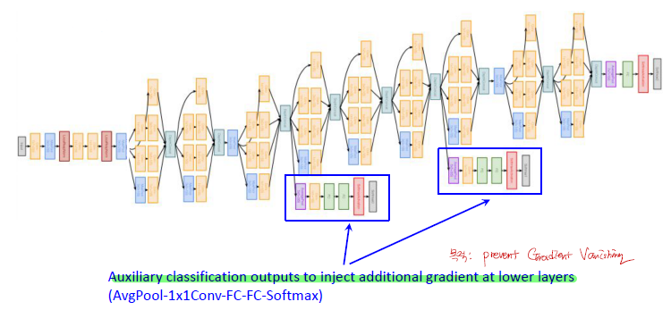
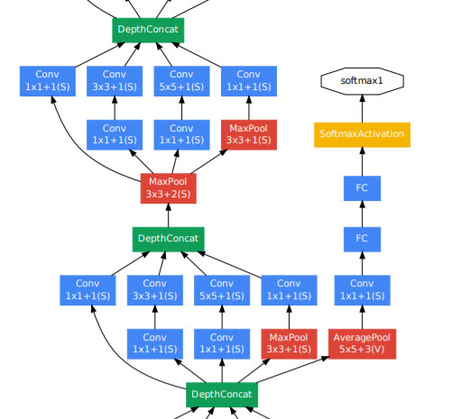

# GoogleNet

----

## 1. Concept

> _**Deeper Networks, with computation efficiency**_

1. inception module
2. Bottleneck 활용
3. Global Average Pooling
4. Auxiliary Function

### 1-1. GoogleNet Architecture

-------------

## 2. inception module

> 각각 다른 filter dimension을 가지는 module 들 (1x1, 3x3, 5x5 Conv + 3x3 pooling) 을 multi-branch로 두어, Ensemble Learning 개념처럼 적용하였다.
> 즉, 좋은 local network topology을 디자인하는 것을 말한다.

### 2-1. concate

> 4가지의 모듈들이 각각의 output을 합치는 작업이다.

위의 4가지 모듈들을 모두 합했을 때의 output은 28x28x(128+192+96+256) = 28x28x672

### 2-2. parameter 갯수

파란색으로 표시된 부분은 모듈들의 각각의 output size들을 말한다. 검은색으로 표시된 부분은 filter들의 size를 말할 것이다.

실제로 parameter들을 계산해보면 위의 그림과 같다. 위의 parameter들을 계산할 때는 filter들의 channel은 input의 channel에 동일하게 맞췄다고 보면 된다.

1. 1x1 : 1x1x256 (1 filter size) x 128 (filter 갯수) x28x28
2. 3x3 : 3x3x256 (1 filter size) x 192 (filter 갯수) x28x28
3. 5x5 : 5x5x256 (1 filter size) x 96 (filter 갯수) x28x28
4. Total : 854M ops

굉장히 computation이 많이 드는 작업.

### 2-3. BottleNeck

854M ops 는 너무 많다. 따라서 bottleneck layer를 중간에 삽입한다.

> bottleneck layer는 1x1 conv layer를 의미한다.  1x1 conv layer들이 channel이 64로써 그전 192, 96, 보다 dimension을 현저히 줄이는 역할을 했다는 것을 알 수 있다.

bottleneck layer를 중간에 삽입한 architecture이다.

1. [1x1 conv] : 1x1x256(bottleneck filter size) x64(filter 갯수) x28x28 (output의 size)
2. [1x1 conv] : 1x1x256(bottleneck filter size) x64(filter 갯수) x28x28 (output의 size)
3. [1x1 conv] : 1x1x256(conv filter size) x128(filter 갯수) x28x28 (output의 size)
4. [3x3 conv] : 3x3x256(conv filter size) x192(filter 갯수) x28x28 (output의 size)
5. [5x5 conv] : 5x5x256(conv filter size) x96(filter 갯수) x28x28 (output의 size)
6. [1x1 conv] : 1x1x256(conv filter size) x64(filter 갯수) x28x28 (output의 size)

--------

## 3. Global Average Pooling

보통 CNN이나 다른 구조들은 마지막에 Fully connected layer를 사용해서 classifier function을 붙여서 분류문제를 해결하곤 했다. 하지만 GooglNet에서는 비용적으로도 큰 FC layer를 줄였다.

_**그 이유는 Global Average Pooling 방법을 이용했기 때문이다.**_

> global average pooling은 전 층에서 산출된 특성맵들을 각각 평균낸 것을 이어서 1차원 벡터를 만들어주는 것이다. 

_**각각의 데이터를 1차원 벡터를 만들어줘야 최종적으로 이미지 분류를 위한 softmax 층을 연결해준 효과를 내기 때문이다.**_ 만약 전 층에서 1024장의 7 x 7의 특성맵이 생성되었다면, 1024장의 7 x 7 특성맵 각각 평균내주어 얻은 1024개의 값을 하나의 벡터로 연결해주는 것이다.

이렇게 해줌으로 얻을 수 있는 장점은 가중치의 갯수를 상당히 많이 없애준다는 것이다. 만약 FC 방식을 사용한다면 훈련이 필요한 가중치의 갯수가 7 x 7 x 1024 x 1024 = 51.3M이지만

_**global average pooling을 사용하면 가중치가 단 1개도 필요하지 않다.**_

-------------

## 4. Auxiliary (보조) classification

> 목적 : 네트워크 깊이가 깊어질수록 gradient vanishing 문제가 생기는 것을 방지하기 위함. 

보조 분류기의 구성을 살펴보면, 5 x 5 평균 풀링(stride 3) -> 128개 1x1 필터커널로 컨볼루션 -> 1024 FC 층 -> 1000 FC 층 -> softmax 순이다. 이 보조 분류기들은 훈련시에만 활용되고 사용할 때는 제거해준다. 

------------

## 5. GoogleNet의 장점

1. param의 갯수를 크게 줄였다.
2. gradient vanish 문제 해결
3. 22 layer

---------------

## Reference

1. [GoogleNet architecture](https://bskyvision.com/539)