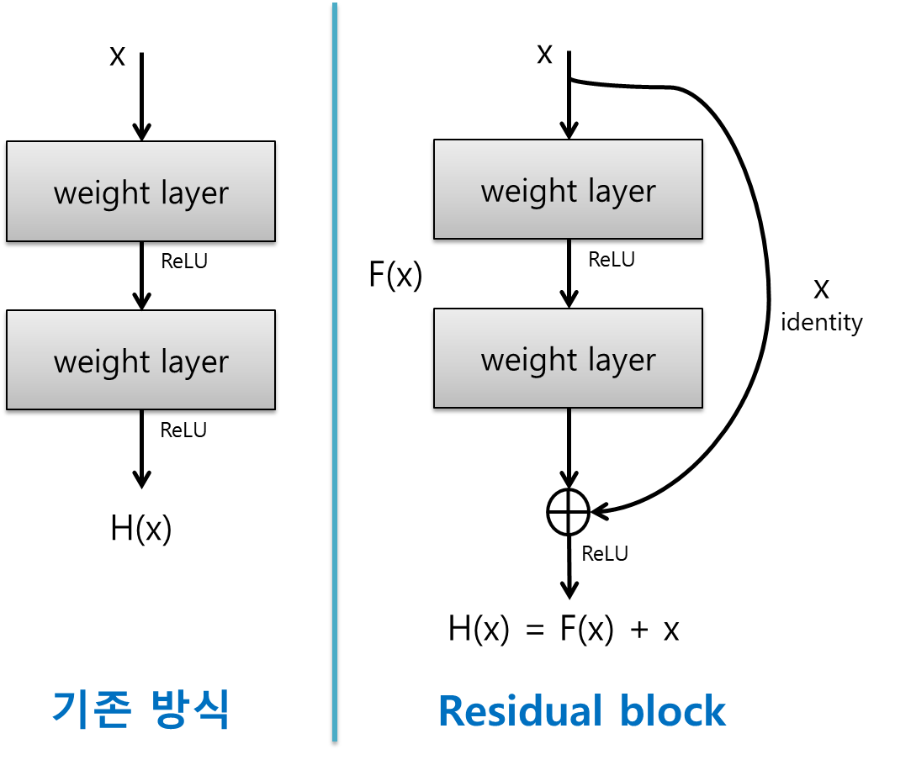
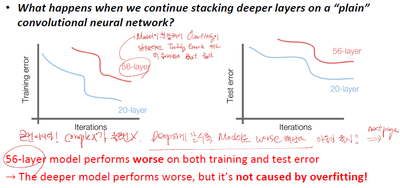
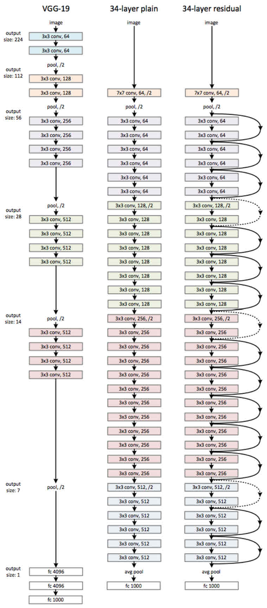
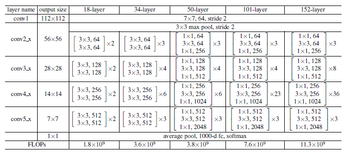
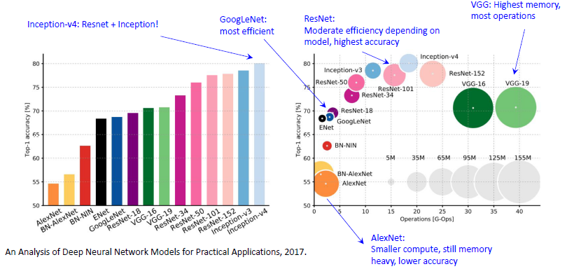
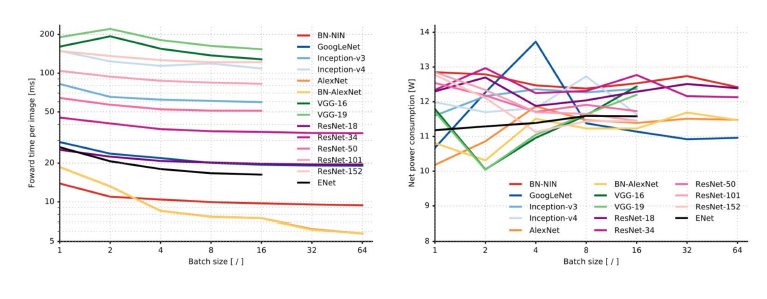

# ResNet

------

## 1. Concept

> _**Very Deep Networks using residual connections**_

### 1-1. 현재까지의 문제점

지금까지는 망의 깊이가 22 layer 까지 밖에 안됬다. 따라서 사람들은 망의 깊이를 더 deep 하게 쌓고 싶어하였고, Deep 하게 쌓았을 때 어떤 문제가 생기는지 알고싶어 하였다.

    plain한 CNN을 쌓으면 어떻게 될까?

만약 Model이 깊게 쌓아서 복잡해져 Overfitting이 일어난다고 하면 Train data에 대해서는 Error가 낮아야하지만, 그림을 보면 56layer가 높은 것을 볼 수 있다.

> 이는 Model이 Deep 하게 쌓았더니 Optimize 자체가 되지 않는 것을 알 수 있다.

_**따라서 ResNet 저자들은 기존의 방식으로는 망을 무조건 깊게 한다고 되는 것이 아니라고 생각을 하였다.**_

### 1-2. 해결책

그래서 ResNet에서는 2가지에 초점을 맞추었다.

1. Deep하게 쌓는 모델들은 가능한 최소한의 layer로 수행해야하며, 깊지 않고 얕은 모델일수록 좋다.
2. 얕은 모델로부터 훈련된 layer들을 카피하도록하고, identity mapping으로 추가적인 layer들을 세팅해야한다.

---------

## 2. Residual Block

기존의 망과 차이점은 지름길(shortcut)을 적용해서 입력값을 출력값에 더해준 것이다.

기존의 신경망은 input x를 넣어서 output y로 매핑하는 H(x)를 학습하는 것이었다.

> 하지만, _**ResNet은 $H(x) = x + F(x)$ 이기 때문에 $F(x)$ 를 0으로 학습하려하였다. layer를 쌓을수록 기존의 데이터가 소실되기 때문에 망을 깊게 쌓아도 성능이 유지된다고 생각한다.**_

여기서 $H(x) - x$ 를 잔차라고 하며, 여기서 ResNet이라는 단어가 생겨난다.

---------

## 3. Architecture

1. 위 그림을 보면, 34층의 ResNet은 _**처음을 제외하고는 균일하게 3x3 사이즈의 conv layer를 사용**_ 했다. 
2. _**activation map 의 size가 반으로 줄어들 때, activation map의 depth를 2배로 높였다.**_ 

> 아마 내 생각인데 layer를 거치면서 identity를 계속 추가하면서 information vanishing 현상이 벌어지지 않아서 그런 것 같다.

---------

## 4. ResNet의 장점

위의 표는 18층, 34층, 50층, 101층, 152층의 ResNet이 어떻게 구성되어 있는가를 잘 나타내준다. 깊은 구조일수록 성능도 좋다. 

_**여기서 152층의 ResNet이 가장 성능이 뛰어나다. 즉, 정말 layer를 깊게 쌓는 Deep Learning이 가능하도록 포문을 열었다.**_

---------

## 5. Comparing Complexity & Forard time and power consumption

---------

## Reference

1. [Improving ResNet : Densly Connected Convolutinoal Networks](https://arxiv.org/abs/1608.06993) - 2016
2. [Improving ResNet : Squeeze-and-Excitation Networks](https://arxiv.org/pdf/1709.01507.pdf) - 2017