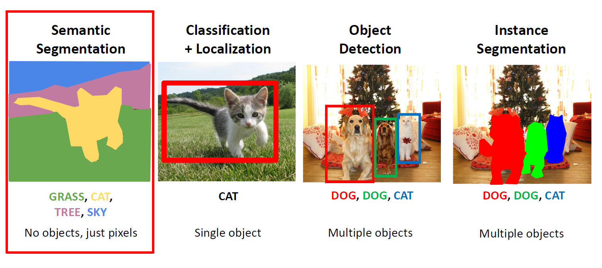

# Semantic Segmentation

ComputerVision은 크게 4가지 틀로 구성된다.

1. Semantic Segementation
2. Classification & Localization
3. Object Detection
4. Instance Segmentation

먼저 Semantic Segmenatation 에 대해서 공부해보자.

## 1. Concept

Semantic Segmentation은 직역하면 의미론적 구분이다. 우리가 computer vision을 하는 목표 중 하나가 이 물체가 어디까지 해당되는지, 즉, 의미론적으로 어디까지가 같은 물체안에 속하는지가 궁금하다.

이러한 문제점들은 instance를 알지 못하면 정확하게 알지 못한다. 하지만, 

> **instance를 구별하는 것이 아니라, pixel만 다뤄서 해결할 수 있다.**
----------

## 2. 현재까지의 문제점

### 2-1. Sliding Window

우리는 window를 움직일 때, extract patch 부분을 한 번 유의깊게 봐보자.

window를 아래로 sliding 할 때, 첫번째 window는 Cow에 대한 pixel만 있어 상관없지만, 2,3번째 window는 Cow에 대한 pixel 말고도 Grass에 대한 정보도 있다.

> _**즉, window를 움직여서 어떤 instance라고 정의해야하는 행위가 instance에 해당하지 않는 정보들을 폐기하는 것과 같은 것이다.**_

### 2-2. Fully Convolutional Networks

FCN을 구성하여 semantic segementation을 한 경우이다.

Conv을 거쳐도 input size를 유지하는 이유는 Score layer에서 Classification class의 갯수 C개만큼 HxW를 만들어둬야 argmax를 거쳤을 때, _**C개의 HxW layer들을 argmax하여 Semantic 적으로 같은 Class 끼리 뭉쳐질 것이다.**_

하지만 이 방법은 단점이 존재한다.
> _**conv layer를 input size에 맞춰 하다보니, GPU에 올릴 때 숫자 size가 너무 커서 Computation expensive하다.**_

-----------

## 3. Encoder-Decoder Networks

> 처음 input data를 Conv를 거칠 때는 DownSampling (보통 CNN에서 많이 씀)
> Latent space를 Conv 거칠 때는 UpSampling (UnPooling, MaxUnPooling, Transpose Convolution)

### 3-1. UnPooling

#### 1) Nearest Neighbor

> Size를 키울 때, 숫자들을 동일하게 맞춰서 키우는 방법

#### 2) Bed of Nails

> Size를 키울 때, 해당 숫자를 제외하고는 다른 곳은 0으로 통일

### 3-2. In Network UpSampling : Max UnPooling

> MaxPooling 작업을 할 때, 해당 max의 자리를 기억해놓는다. 따라서 max인 지점을 나중에 UpSampling 해도 그 해당 지역에 가도록 한다.

### 3-3. Learnable UpSampling : Transpose Convolution

#### 1) 그림으로 풀이

Convolution을 처음할 때, stride를 1에서 2로 올렸다.

UpSampling을 진행할 때, 위에 그림처럼 _**빨간색과 파란색이 겹치는 부분처럼 생기는 경우는 sum을 한다.**_

#### 2) Matrix로 풀이

1D라고 가정하였을 때, X는 Filter, a를 1d image라고 생각하자.
이 때 filter의 size=3, stride=1, padding=1 이다.

stride가 1이기 때문에, $x^T*a$은 $a$ 길이가 4에서 6으로 증가하였다. 따라서 크게 바뀌지 않았고 일반적인 CNN과 비슷하다.

stride가 2이기 때문에, $x^T*a$은 $a$ 길이가 2에서 6으로 증가하였다. _**따라서 spartial Resolution이 굉장히 증가하였다.**_

그림으로 표현하자면 $az+bx$ 부분인 것이다. 

> _**즉, stride를 2이상 한다면, decoder 부분은 spartial Resolution이 커진다는 것을 우리는 알수 있다.**_

--------

## 4. 장점

1. 기존 CNN 방법으로는 너무나 많은 Computation 이 필요했었다.
2. Encoder-Decoder 구조와 stride 2이상으로 하는 filter를 접목하였더니 spartial resolution이 증가하는 현상이 보였다.