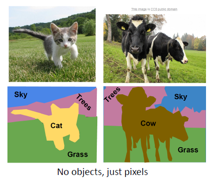

# Semantic Segmentation

ComputerVision은 크게 4가지 틀로 구성된다.

1. Semantic Segementation
2. Classification & Localization
3. Object Detection
4. Instance Segmentation

먼저 Semantic Segmenatation 에 대해서 공부해보자.

----------

## 2. 현재까지의 문제점

### 2-1. Sliding Window

우리는 window를 움직일 때, extract patch 부분을 한 번 유의깊게 봐보자. window를 아래로 sliding 할 때, 첫번째 window는 Cow에 대한 pixel만 있어 상관없지만, 2,3번째 window는 Cow에 대한 pixel 말고도 Grass에 대한 정보도 있다.

> _**즉, window를 움직여서 어떤 instance라고 정의해야하는 행위가 instance에 해당하지 않는 정보들을 폐기하는 것과 같은 것이다.**_

### 2-2. Fully Connected Networks

> Fully Connected Networks의 경우에는 pixel마다 classification을 진행해야한다는 단점이 존재한다.

-----------

## 2. Concept

### 2-1. UpSampling의 등장

Semantic Segmentation은 직역하면 의미론적 구분이다. 우리가 computer vision을 하는 목표 중 하나가 이 물체가 어디까지 해당되는지, 즉, 의미론적으로 어디까지가 같은 물체안에 속하는지가 궁금하다. 이러한 문제점들은 instance를 알지 못하면 정확하게 알지 못한다. 그래서 이를 _**UpSampling**_ 기법으로 해결하였다.

> **이 방법으로 instance를 따로 구별하는 것이 아니라, pixel만 다뤄서 해결할 수 있다.**

### 2-2. Fully Convolution layer의 등장

또한 이전까지 Semantic Segmentation 분야에서는 각 픽셀 별로 일정한 Bouding Box 크기 만큼 Classification을 적용하여 해당 픽셀의 종류를 추론하는 비효율적인 방식의 접근들이 있었다. 

> **하지만 이 논문은 Fully Connected Layer 대신 1x1 컨볼루션을 사용하여 연산량을 획기적으로 줄였고, Segmentation의 퀄리티까지 높이는 성과를 내었다.**

- **영향력**: 인용 횟수가 약 14000회에 달하며, 다른 컴퓨터 비젼 분야의 접근들에게도 많은 영향을 주었습니다.
- **주요 기여**: 1x1 컨볼루션을 사용하여 입력 크기에 상관없이 클래시피케이션을 수행할 수 있는 기법 제시 

-----------

## 3. Fully Convolutional Layers & Encoder-Decoder Networks

Fully Convolutional Layer을 구성하여 semantic segementation을 한 경우이다.

Conv을 거쳐도 input size를 유지하는 이유는 Score layer에서 Classification class의 갯수 C개만큼 HxW를 만들어둬야 argmax를 거쳤을 때, _**C개의 HxW layer들을 argmax하여 Semantic 적으로 같은 Class 끼리 뭉쳐질 것이다.**_

하지만 이 방법은 단점이 존재한다.
> _**conv layer를 input size에 맞춰 하다보니, GPU에 올릴 때 숫자 size가 너무 커서 Computation expensive하다.**_

> 처음 input data를 Conv를 거칠 때는 DownSampling (보통 CNN에서 많이 씀)
> Latent space를 Conv 거칠 때는 UpSampling (UnPooling, MaxUnPooling, Transpose Convolution)

### 3-1. UnPooling

#### 1) Nearest Neighbor

> Size를 키울 때, 숫자들을 동일하게 맞춰서 키우는 방법

#### 2) Bed of Nails

> Size를 키울 때, 해당 숫자를 제외하고는 다른 곳은 0으로 통일

### 3-2. In Network UpSampling : Max UnPooling

> MaxPooling 작업을 할 때, 해당 max의 자리를 기억해놓는다. 따라서 max인 지점을 나중에 UpSampling 해도 그 해당 지역에 가도록 한다.

하지만 이 방법도 전의 있던 자리를 memory에 저장해야한다. 따라서 memory 부하가 어느정도 있기 때문에 다른 방법이 필요하다.

### 3-3. Learnable UpSampling : Transpose Convolution

#### 1) 그림으로 풀이

Convolution을 처음할 때, stride를 1에서 2로 올렸다.

UpSampling을 진행할 때, 위에 그림처럼 _**빨간색과 파란색이 겹치는 부분처럼 생기는 경우는 sum을 한다.**_

#### 2) Matrix로 풀이

1D라고 가정하였을 때, X는 Filter, a를 1d image라고 생각하자.
이 때 filter의 size=3, stride=1, padding=1 이다.

stride가 1이기 때문에, $x^T*a$은 $a$ 길이가 4에서 6으로 증가하였다. 따라서 크게 바뀌지 않았고 일반적인 CNN과 비슷하다.

stride가 2이기 때문에, $x^T*a$은 $a$ 길이가 2에서 6으로 증가하였다. _**따라서 spartial Resolution이 굉장히 증가하였다.**_

그림으로 표현하자면 $az+bx$ 부분인 것이다. 

> _**즉, stride를 2이상 한다면, decoder 부분은 spartial Resolution이 커진다는 것을 우리는 알수 있다.**_

--------

## 4. 장점

1. 기존 CNN 방법으로는 너무나 많은 Computation 이 필요했었는데 이를 UpSampling 기법 (Max UnPooling : memory 부하)과 Fully Convolution Network (Classification을 생략)를 통해 computation을 확 줄였다.
2. stride 2이상으로 하는 filter를 접목하였더니 spartial resolution이 증가하는 현상이 보였다.

--------

## 5. 단점

_**FCN의 한계점은 Upsampling에 너무 의존하여 결과 값을 추출한다는데 있다.**_  컨볼루션과 풀링을 거치면서 사라진 위치 정보 값을 복원하는데에는 Upsampling만으로는 한계가 있었던 모양이다. 다음 논문으로는 이를 개선한 Deconvolution Network이다.

--------

## Reference

1. [Semantic Segmentation 제일 좋음](https://yeomko.tistory.com/18)
2. [Semantic Segmentation2](https://m.blog.naver.com/PostView.nhn?blogId=laonple&logNo=220958109081&proxyReferer=https:%2F%2Fwww.google.com%2F)