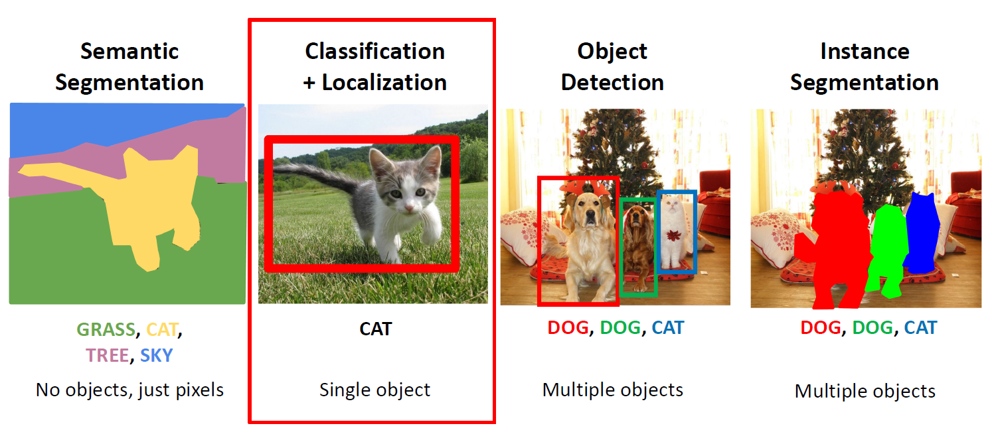
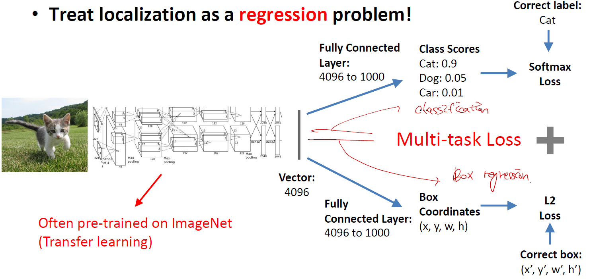
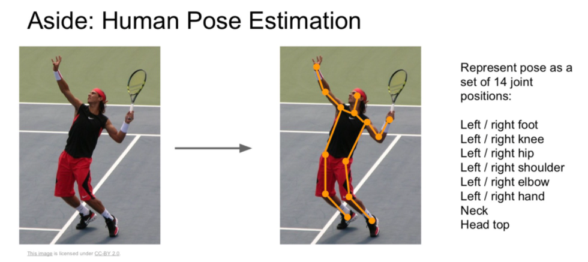
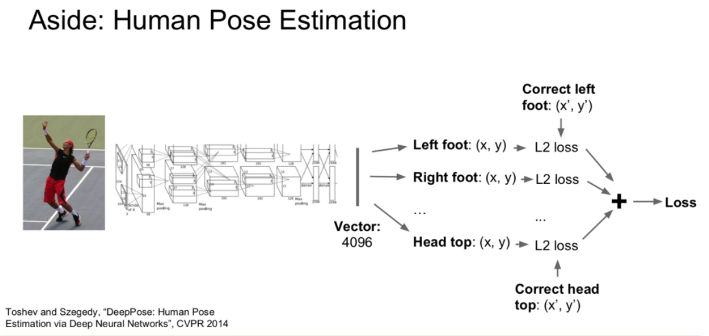

# Classification + Localization

우리는 지금까지 semantic segementation에 대해서 배웠다. 따라서 이제 Classification과 Localization을 같이 할수 있는 방법에 대해 공부해보자.

--------

## 1. Concept

> 말 그대로 모델을 두 개를 짜는것이다.

1. 고양이를 구분하는 방법은 Classification 이다.
2. 고양이를 구분하는 box를 그리는 방법은 regression 이다.

------------

## 2. Application

------------

## Reference

1. [Classfication & Localization](https://leechamin.tistory.com/112)