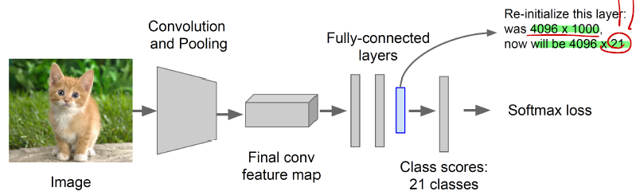

# R-CNN to Fast, Faster CNN

## R-CNN


### 1. Concept

- **영향력** : 인용 횟수가 무려 11000회에 달하며, 이후에 이어지는 R-CNN 시리즈들의 시작을 연 논문입니다.
- **주요 기여** : CNN을 사용하여 object detection task의 정확도와 속도를 획기적으로 향상시켰습니다.
- **성능** : Pascal VOC  2010을 기준으로 53.7%이며, 이미지 한 장에 CPU로는 47초, GPU로는 13초가 걸립니다.

### 2. Procedure

#### 1) Trained Classification model for ImageNet


기존의 AlexNet, VGGNet 같은 Model을 써서 Model을 학습을 시켜둔다.

#### 2) Fine-Tuned Model for Detection



기존 ImageNet 의 1000개의 class 대신 Pascal VOC dataset의 class 20개와 background 1개, 총 21개의 classification을 하도록 마지막 node 수를 변경한다.

따라서 마지막 FC으로 output을 뱉을 때, _**4096x21**_ 으로 만든다.

#### 3) Extract Features


1. Selective Search를 ROI(regions of interest)를 통해 region proposal한 부분들을 가지고 온다.
2. 각 지역을 미리 trained 되어있는 CNN에 input size을 맞게 Crop & Warp를 한다.
3. CNN을 통과시켜서 Crop & Warp를 거친 data들을 하나씩 feature를 뽑아서 feature를 disk에 저장

#### 4) Train binary SVM per class → classify features


cached한 region feature들을 class에 대해 positive sample인지 negative sample인지 SVM으로 classification을 해보자.

#### 5) Bounding Box Regression


(dx, dy, dw, dh) 

---------------

## Fast R-CNN

### 1. R-CNN의 문제점

1. ROI들을 모두 저장하기 때문에 각 ROI에 맞는 CNN parameter들을 모두 저장하고 있어야한다. -> _**storage huge**_
2. 처음 ImageNet을 training할 때 필요한 Softmax Classfier, SVM, Box Regressor들을 모두 따로 훈련한다. -> _**computation expensive**_
3. _**training 시간이 84h**_ 로 굉장히 오래걸린다.
4. _**detection도 오래걸린다.**_

### 2. Concept

- **주요 기여** : 각 ROI를 모두 feature들을 뽑아 저장한 것이 아니라 _**기본 image 상에서 activation map에 ROI를 directly 투영시켜**_ feature들을 저장하지 않아도 됬다는 점이 성능에 확실한 기여를 하였다.

### 3. Fast R-CNN Architecture


1. 영상에서 CNN을 통해 feature들을 미리 뽑아낸다.
2. 이와 동시에 영상에서 ROI를 Selective Search를 통해 뽑아낸다.
3. CNN으로 뽑아낸 activation map에 ROI를 대입해서 activation map 안에서의 ROI를 새롭게 정의한다.
4. 각 ROI들을 ROI Pooling 작업을 통해 7x7x512을 뽑아낸다.
5. FC를 통과해서 Binary Classfication & Regression을 동시에 진행한다.


6. Classification loss와 Bounding box loss를 이용해서 Backpropagation을 적용한다.

-----------

## R-CNN vs SPP vs Fast R-CNN


실제로 성능을 비교해보면 ROI를 고르고 image에서 각 ROI를 모두 feature extraction을 거친 R-CNN은 성능이 굉장히 낮은 것을 볼 수 있다.

하지만 ROI를 고르고 image를 CNN으로 activation map만 고른후, ROI를 projected 하여 바로 classification을 한 Fast R-CNN은 성능이 굉장히 좋게 나왔다.

> _**즉, 각 ROI를 모두 feature들을 뽑아 저장한 것이 아니라 기본 image 상에서 ROI를 투영시켜 feature들을 저장하지 않아도 됬다는 점이 성능에 확실한 기여를 하였다.**_

------------

## Faster R-CNN


Fast R-CNN이 Selective Search로 뽑은 ROI를 기존 image에 projected 한 것이 아니라, CNN으로 뽑아낸 activation map에 ROI를 directly projected 하여 Crop & Warp한 data의 feature들을 모두 disk 에 저장하는 문제를 해결하였다.

하지만 _**기존 R-CNN, Fast R-CNN 모두 ROI (Region of Interest)를 selective search를 통해 미리 뽑아놔야한다.**_

### 1. Concept

- 영향력: SPPNet의 Kaming He와 R-CNN 창시자인 Ross가 각각 2저자 3저자로 참여했으며, 인용 횟수는 무려... 무려 15000회에 달한다.
- 주요 기여: Faster R-CNN은 애초에 pre-defined 된 ROI을 뽑는 것을 Neural Network로 한 번에 뽑아보자! 라는 것이 핵심이다. _**진정한 의미의 end-to-end object detection 모델을 제시하였다.**_
- 결과: 모든 단계를 다 합쳐서 5fps 라는 빠른 속도를 내며 Pascal VOC를 기준으로 78.8% 라는 성능을 낸다. 

### 2. Architecture


논문에는 이 figure가 나와있으나 이해하기 어렵다. 아래의 그림으로 대신 설명하겠다.


1. K개를 정해주면 k-anchor를 random하게 만들어본다.
2. Faster R-CNN 에서는 Conv를 거쳐서 feature map을 미리 뽑아둔다.
3. 3x3xC conv를 거쳐서 channel을 256, or 512을 거친다.
4. 각각 1x1x256 or 512x(2x9), 1x1x256 or 512x(4x9) 을 거친다. 
   1. 9는 k-anchor를 말한다.
   2. 1x1xC conv layer를 쓴 이유(Fully Connected Layer)는 입력 이미지의 크기에 상관없이 동작할 수 있도록 하기 위함이다. 
   3. 2는 object인지 아닌지 binary classification, 4는 box regression을 표현하는 (x,y,w,h).
5. _**1번의 1x1 컨볼루션으로 H x W 개의 앵커 좌표들에 대한 예측을 모두 수행한 것이다.**_ 이제 이 값들을 적절히 reshape 해준 다음 Softmax를 적용하여 해당 앵커가 오브젝트일 확률 값을 얻눈다.
6. 먼저 Classification을 통해서 얻은 물체일 확률 값들을 정렬한 다음, 높은 순으로 K개의 앵커만 추려낸다. 그 다음 K개의 앵커들에 각각 Bounding box regression을 적용해준다. 그 다음 Non-Maximum-Suppression을 적용하여 RoI을 구해준다.

#### 2-1. Non-Maximum Suppression

```python
def nms(boxes, probs, threshold):
  """Non-Maximum supression.
  Args:
    boxes: array of [cx, cy, w, h] (center format)
    probs: array of probabilities
    threshold: two boxes are considered overlapping 
        if their IOU is larger than this threshold
    form: 'center' or 'diagonal'
  Returns:
    keep: array of True or False.
  """
 
  order = probs.argsort()[::-1]
  keep = [True]*len(order)
 
  for i in range(len(order)-1):
    ovps = batch_iou(boxes[order[i+1:]], boxes[order[i]])
    for j, ov in enumerate(ovps):
      if ov > threshold:
        keep[order[j+i+1]] = False
  return keep
```

1. 같은 class에 대해 높은-낮은 confidence 순서로 정렬한다. (line 13)
2. 가장 confidence가 높은 boundingbox와 IOU가 일정 이상인 boundingbox는 동일한 물체를 detect했다고 판단하여 지운다.(16~20) 보통 50%(0.5)이상인 경우 지우는 경우를 종종 보았다.
3. _**NMS를 하려는 가장 큰 이유는 역시 중복제거이기 때문에, 예측한 박스들 중 IOU가 일정 이상인 것들에 대해서 수행하게 된다.**_

----------

## R-CNN vs SPP vs Fast R-CNN


실제로 Faster R-CNN은 Speed 측면에서 월등히 좋은 것으로 나타났고, 정확도 또한 개선된 것을 보여주었다.

---------------

## Reference

1. [R-CNN 정리](https://bskyvision.com/694?category=635506)
2. [R-CNN 정리2](https://yeomko.tistory.com/13)
3. [Fast R-CNN 정리](https://bskyvision.com/702?category=635506)
4. [Faster R-CNN 정리, code](https://yeomko.tistory.com/17)
5. [Non-Maximum Speed](https://dyndy.tistory.com/275)
6. [Transitional Equiavalence vs Transitional Invariant](https://towardsdatascience.com/translational-invariance-vs-translational-equivariance-f9fbc8fca63a)