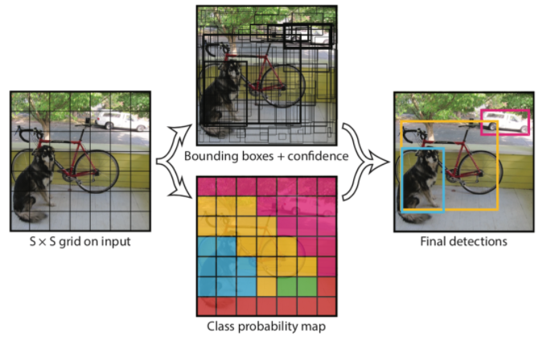

# YOLO (You Only Look Once!)

## 1. Concept

- **영향력**: Joseph Redmon라는 사람이 1 저자이며 R-CNN의 Ross가 3 저자로 참여했습니다. 인용 횟수는 8천회에 달한다.
- **주요 기여** : 1 Step Object Detection 기법을 제시하였으며, fps가 무려 45로 속도 측면에서 획기적인 발전을 이루었다.
https://pjreddie.com/

------------

## 2. Architecture

Yolo가 기존의 Object Dection (R-CNN, Fast R-CNN, Faster R-CNN)과 가장 크게 구분되는 부분은 기존에 1) region proposal 2) classification 이렇게 두 단계로 나누어서 진행하던 방식에서 _**region proposal 단계를 제거하고 1번에 Object Detection을 수행하는 구조를 갖는다는 점이다.**_ 

### 2-1. Grid

먼저 입력 이미지를 S X S grid 영역으로 나눕니다. 이제 각 grid 영역에서 먼저 물체가 있을 만한 영역에 해당하는 B개의 Bounding Box를 예측한다. B를 기본으로 3이라고 추천하지만, 논문에서는 B=2로 정했다.

### 2-2. Bounding Box(x, y, w, h, confidence)

B는 (x, y, w, h, confidence)로 나타내어 지는데 (x, y)는 bounding box의 중심점 좌표이며 w, h는 넓이와 높이다. 

$$Pr(Object) * IOU^{Truth}_{Pred}$$

다음으로 해당 박스의 신뢰도를 나타내는 Confidence를 계산한다. 이는 해당 grid에 물체가 있을 확률 Pr(Object)와 예측한 박스와 Ground Truth 박스와의 겹치는 영역을 비율을 나타내는 IoU를 곱해서 계산한다.

### 2-3. Classification

$$Pr(Class|Object)$$

그 다음으로 각각의 grid마다 C개의 class에 대하여 해당 class일 확률을 계산하며 수식은 위와 같다. 이 때, 특이한 점은 기존의 Object Detection에서는 항상 class 수 + 1 (배경)을 집어넣어 분류를 하는데, yolo는 그렇지 않다.

_**이렇게 yolo는 입력 이미지를 grid로 나누고, 각 grid 별로 Bounding Box와 Classification을 동시에 수행한다.**_

----------

## 3. Network Design (나중에)

----------

## Reference

1. [YOLO 정리](https://yeomko.tistory.com/19?category=888201)