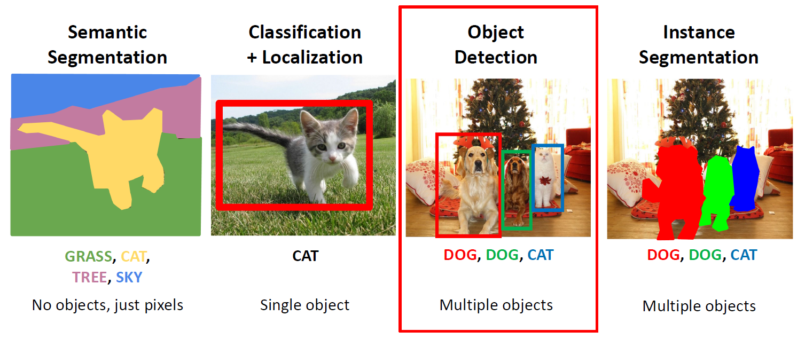
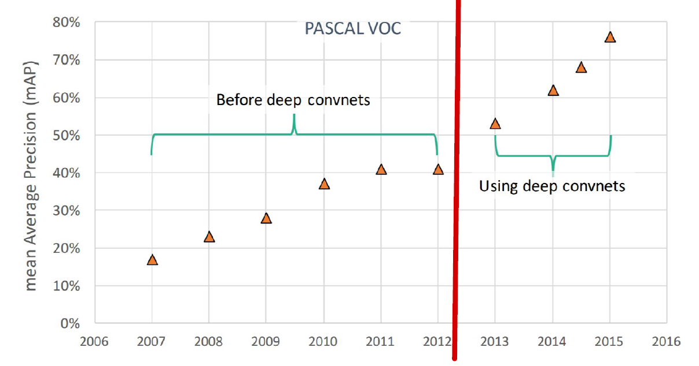
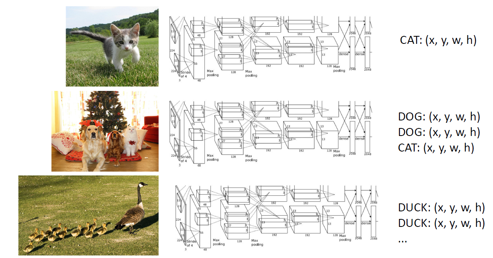
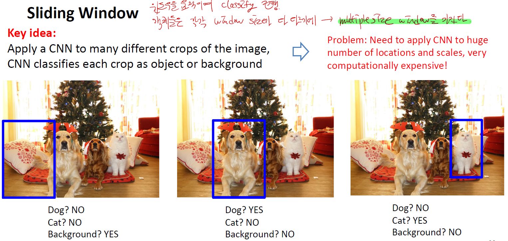
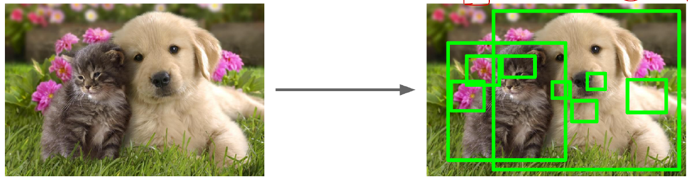
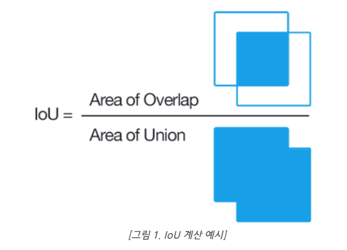
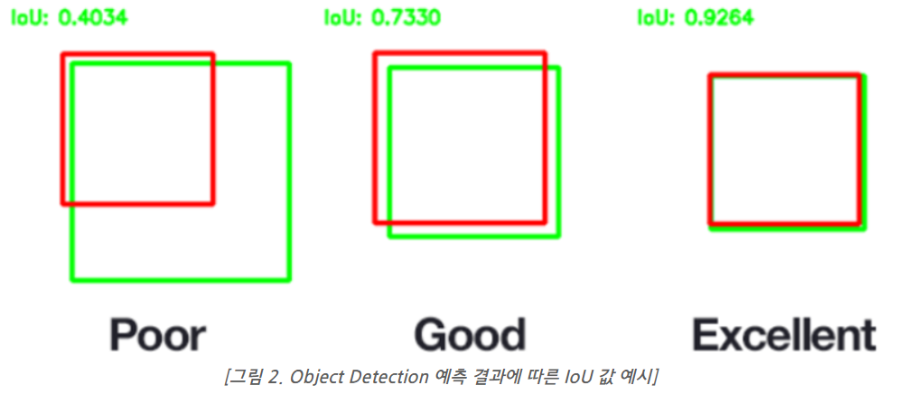
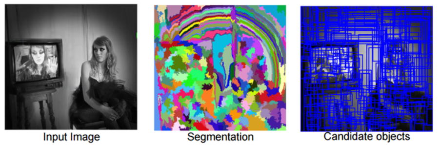
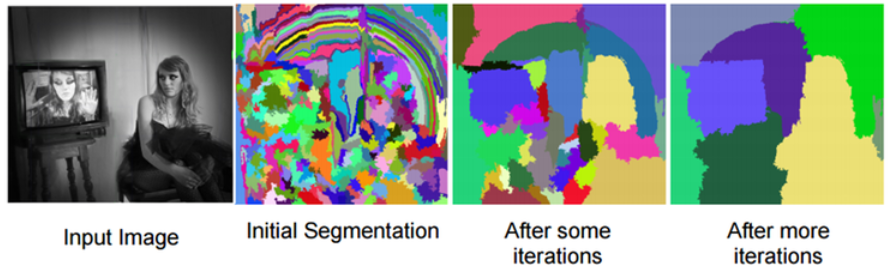
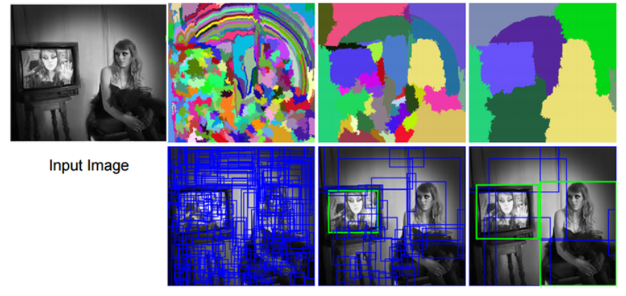

# Object Detection

------

## 1. Object Detection's performance

_**DeepLearning**_ 이 Object Detection에 적용된 이후로 성능은 급증하기 시작하였다. 그래서 어떻게하면 객체인식에 특별화된 architecture를 만들 것인지에 대해 알아보자.

1. [R-CNN (Region CNN)](08_Object_Detection(R-CNN_all).md)
2. [Fast R-CNN](08_Object_Detection(R-CNN_all).md)
3. [Faster R-CNN](08_Object_Detection(R-CNN_all).md)
4. [YOLO](08_Object_Detection(YOLO).md)

앞으로 이렇게 4가지에 대해 알아볼 것이다.

----------

## 2. Concept

실제로 객체인식은 image 안에 어떤 Object가 있는지 image 마다 다르다. 따라서 image마다 따로 customize 하지 않아도 맞춤형 object detection을 할 수 있는 architecture가 필요하다.

### 2-1. Sliding Window

> window를 움직이며 classification을 진행. object들은 각각 window size가 다르며 multiple window를 가진다.

### 2-2. Region Proposals or Region of Interest (ROI)

> 객체가 가질 것 같은 image region을 찾는다 : **blobby**

이렇게 하면 상대적으로 run time이 짧아진다. 

ex) Selective Search는 superpixel segmentation method를 사용한다. 이 selective search는 CPU로 몇 초만에 1000개의 region proposal을 준다.

--------------

## cf)

### 1. IOU (Integrate of Union)

IOU는 Overlap의 넓이와 Union의 넓이는 나눈 갑으로, True 값에 Overlap이 많을수록 Object Detection을 잘했다는 기준이다.

### 2. Superpixel

> 자신의 pixel과 비슷한 group (color, distance)끼리 묶는 것을 말한다.

superpixel은 조절가능하고 inregular한 shape이므로 Graph Neural Network와 잘맞는다.

### 3. Selective Search (중요한 개념)

#### 1) sub-segmentation

각각의 객체라고 판단하는 작업을 먼저 진행한다. 그 후 candidate object들을 만든다.

#### 2) integrate small one first 

이 때는 greedy 알고리즘을 적용, 여러 영역들을 비교해서 가장 비슷한 영역을 고르고 이것들을 좀 더 큰 영역으로 통합하면서 object를 줄이는 작업이다. _**SuperPixel을 여기서 쓸 것이다. (같은 그룹끼리 묶기)**_

아래 그림은 그 예를 보여주며, 초기에 작고 복잡했던 영역들이 **유사도**에 따라 점점 통합된다.

#### 3) 통합된 영역들을 바탕으로 candidate region을 도출해낸다.

위의 작업들을 어느 기준까지 계속 반복 작업을 한다.

--------

## Reference

1. [How to calculate Object Detection's Performance : IOU, Precision, Recall, FP/TP, FPS](https://hoya012.github.io/blog/Tutorials-of-Object-Detection-Using-Deep-Learning-how-to-measure-performance-of-object-detection/)
2. [Selective Search](https://m.blog.naver.com/laonple/220930954658)