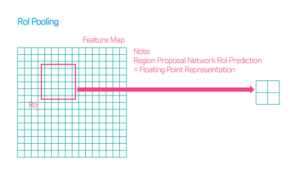

# Instance Segementation

## 1. Concept

- **영향력**: Mask R-CNN은 COCO challenges의 모든 task에서 이전 모델보다 우수한 성능 보임 (in instance seg, bounding-box(이하 bbox) object detection, person keypoint detection)
- **주요 기여** : Mask R-CNN은 Faster R-CNN을 확장하여 Instance Segmentation에 적용하고자 하는 모델

## 2. Architecture

### 2-1. Faster R-CNN에 존재하는 "object Detection branch"에 병렬로 "object mask prediction branch" 추가

Mask R-CNN은 
1. 기존의 Faster R-CNN을 Object Detection 역할을 수행 
2. 각각의 RoI(Region of Interest)에 Mask segmentation을 해주는 작은 FCN(Fully Connectd Network)을 추가

### 2-2. Mask prediction & class prediction 을 decouple 함 (클래스 상관없이 masking)

Mask R-CNN의 두 번째 핵심은 Mask prediction 과 class prediction 을 decouple 했다는 점이다.

이를 통해 mask prediction에서 다른 클래스를 고려할 필요 없이 binary mask 를 predict 하면 되기 때문에 성능의 향상을 보였다고 한다.

> 즉,ROI 내에서 클래스 예측하는 네트워크와 masking 하는 네트워크를 분리

### 2-3. ROI Pooling -> ROI Align

#### 1) Pooling

> **Pooling 정의** : pooling == sampling == resizing이다. 
> pooling은 모은다는 뜻이고, sampling은 고른다는 뜻이고, resizing은 크기를 바꾼다는 뜻이다. 어떤 작업을 하건 pooling을 거치면 크기가 작아진다는 것이 핵심이다.

Region Proposal Network RoI Prediction에서 픽셀좌표값이 소수점으로 나올 경우.

_**RoI Pooling에서는 먼저 각 좌표를 반올림한다.**_

그 다음에 반올림한 좌표를 가지고 Pooling을 해준다.

RoI Pooling의 경우 위 그림과 같은 과정을 거치는데, _**소수점을 반올림한 좌표를 가지고 Pooling을 해주면 input image의 원본 위치 정보가 왜곡됨.**_ 

왜곡되면 classificaion task에서는 문제가 발생하지 않지만, 정확하게 _**pixel-by-pixel 로 detection 하는 segmentation task 에서는 문제 발생**_

#### 2) Align

- **파란색 점선 그리드** : feature map
- **검은색 라인** : RoI(위 그림에선 with 2x2 bins)
- **점** : 각 bin에서 4개의 샘플링 포인트

#### ROI Align 목적
- RoIAlign : 피쳐맵 위에 있는 그리드 포인트로부터 bilinear interpolation을 하여 각 샘플링 포인트의 값을 계산함
- RoI에서 얻어내고자 하는 정보 : 박스 안의 동그라미 점(샘플링 포인트)
- 이미지 데이터 : 정수인 좌표 값만 가지고 있으므로, 화살표로 표현된 방법을 통해 동그라미 점의 값을 구하겠다는 것이다.

> _**결국 feature map에서의 ROI Align이기 때문에 feature map이 int로 쪼개지면 실제 image에서는 정확하지 못하게 object를 detect하는 것이다.**_
>  
> _**따라서 ROI를 activation map grid에 맞춰서 하는 것이 아니라 소수점으로도 움직일 수 있도록 한 것이다.**_

**bilinear interpolation**
> 왼쪽 위의 Roi bin은 네 개의 피쳐로 이루어져 있고, 4개의 피쳐가 차지하고 있는 비율을 곱해준다.

Max Pooling을 해준다.

------------

## Reference

1. [Mask R-CNN 정리 자세히 영어, 이 부분이 제일 정확함](https://towardsdatascience.com/understanding-region-of-interest-part-2-roi-align-and-roi-warp-f795196fc193)
2. [Mask R-CNN 정리, 짧은 정리](http://machinelearningkorea.com/2019/07/18/mask-rcnn-%ED%95%B5%EC%8B%AC%EC%9D%B4%ED%95%B4/)
3. [Mask R-CNN 정리 자세히](https://cdm98.tistory.com/33)
4. [Mask R-CNN 정리 자세히2](https://mylifemystudy.tistory.com/82)