# Generative Adversarial Networks (GAN)

## 1. Concept

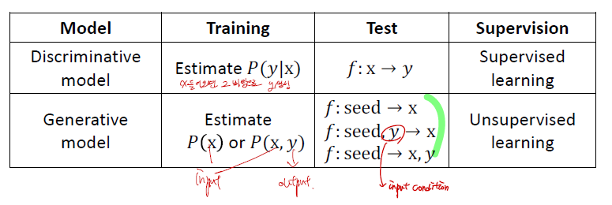

기본적인 concept은 Discriminative Model 과 Generative Model을 같이 경쟁적으로 훈련시켜서 Discriminative Model이 Fake Image를 구별하지 못하도록 하는 것이 Concept 이다.

- **영향력** : 컴퓨터비젼에 새로운 신드롬을 불고 일어났다.
- **주요 기여** : generative model의 중요성

--------------

## 2. 조건부확률

$$P(A\cap B) = P(A)P(B|A)$$
- $P(A\cap B)$ : A와 B가 동시에 일어날 확률
- $P(A)$ : A가 일어날 확률
- $P(B|A)$ : A가 일어났을 때 B가 일어날 확률

조건부확률 개념이 GAN에서 굉장히 중요하다.

그 이유는 아래 그림으로 설명하겠다.

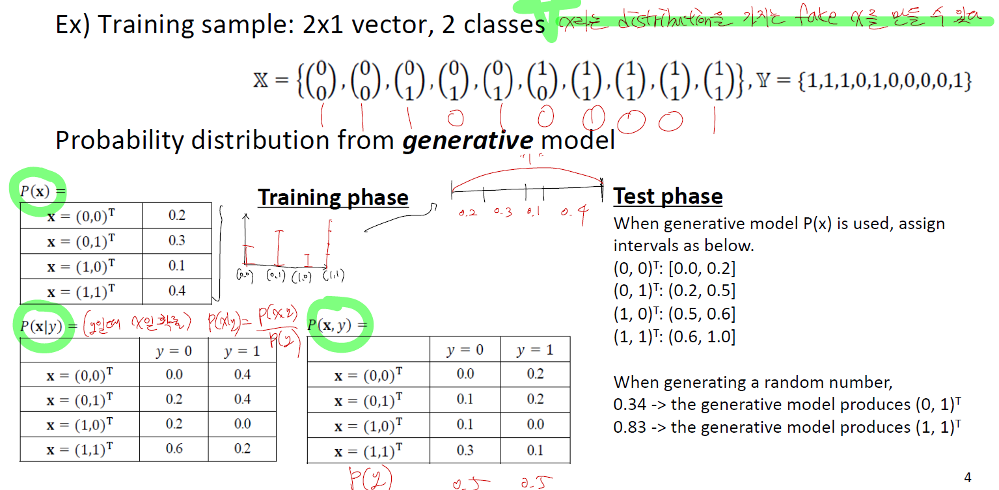

GAN은 input을 X로 넣고 Y를 예측하는 시스템에서 벗어나서 X를 생성해내는 모델이다.

> _**따라서 기존 Data들을 학습해서 input x의 distribution, $P(x)$ 을 알아내는 작업이 중요하다.**_
> 
> $$P(X) = \frac{P(X\cap Y)}{P(Y|X)}$$
> _**하지만 우리는 이미 $P(X\cap Y)$, $P(Y|X)$을 기존 data들로 $P(x)$ 를 알 수 있다.**_

따라서 그림을 보면 주어진 data로 $P(x)$ 를 간단하게 구할 수 있다.

--------------

## 3. Architecture

앞서서 우리는 기존 Data들의 Distribution을 간단하게 구하는 방법을 보았다.

하지만 image Data는 $256_{image pixel}^{256*256*3 (image size)}$ 의 경우의 수를 가지며 이 모든 경우의 수들을 일일히 구할 수 없다.

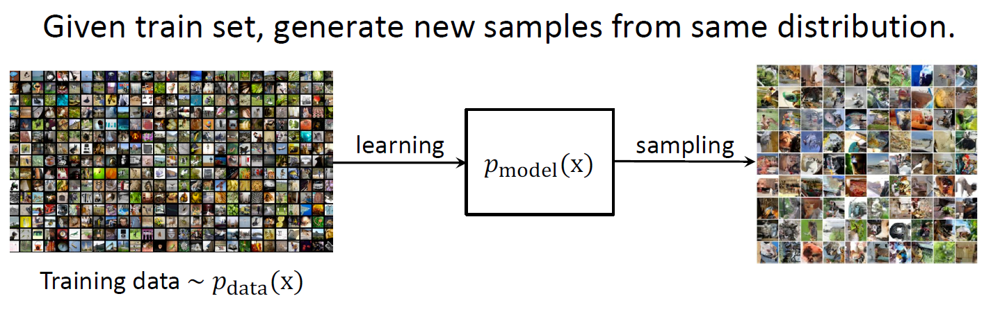

> 1. 따라서 기존 data들을 train 시켜서 data들의 Distribution을 찾는다.
> 2. Data Distribution에서 uniform 하게 sampling을 진행한다.
> 3. Zmap과 training image 간에 관계가 맞는지 여부는 Discriminative Model이 판가름한다. 

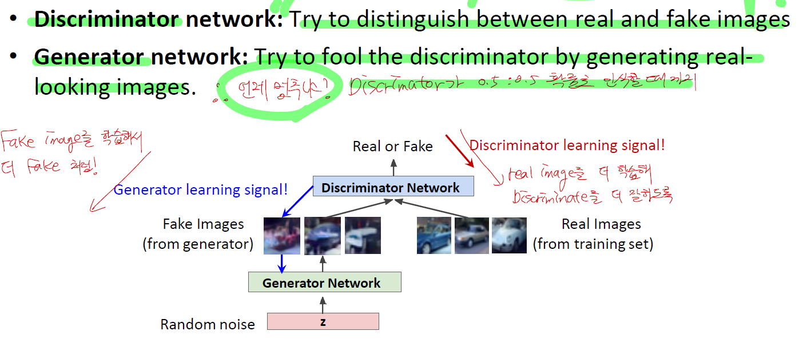

_**Zmap을 이용해서 Generator Network가 fake X의 Distribution을 만들어낼 때,  Generator Network는 fake X Distribution을 Real X Distribution과 일치하도록 만드는 지점까지 Training한다.**_

--------------

## 4. Loss function

$$min_{\theta g} max_{\theta d} [E_{x \sim data}(\log{D_{\theta d} (x))} + E_{z \sim p(z)}(1 - \log{D_{\theta d} (G_{\theta g}(z)))}]$$

- $\theta_d$ : Discriminative
  - x가 real일 때 : Loss = $\log{D_{\theta d}(x)}$ --> Max
  - x가 Fake일 때 : Loss = $1 - \log{D_{\theta d} (G_{\theta g}(z))}$ --> Min
- $\theta_g$ : Generative
  - x가 Fake일 때 : $1 - \log{D_{\theta d} (G_{\theta g}(z))}$ --> min
-  $G_{\theta g}(z)$ 에서 z는 Generative model의 latent vector, $D_{\theta d}(G_{\theta g}(z))$ 는 $G_{\theta g}(z)$가 real에 가까울수록 $D_{\theta d}(G_{\theta g}(z)) \approx 1$. **즉, Discriminative가 real이라고 판단하게끔 하는것이 목표다.** 따라서 $1 - \log{D_{\theta d} (G_{\theta g}(z))}$ 을 1~무한대 사잇값에서 _**1로 수렴하게 하는것이 필요하다.**_

--------------

## 5. Gradient Problem

### 5-1. Loss Function

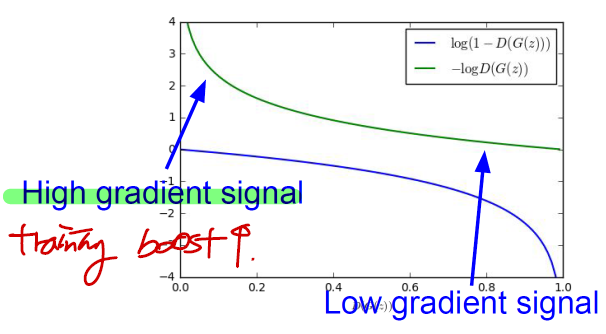

$1 - \log{D_{\theta d} (G_{\theta g}(z))}$ 을 minimum으로 하려고 보니, $D_{\theta d} (G_{\theta g}(z))$는 처음에 fake data 쪽에 가까우니 0부터 시작할 것이고, 그래프를 보면 기울기가 완만하다가 급해진다. 이는 training 속도에 저하가 될 것이라고 판단 가능하다.

_**따라서 $\log{D_{\theta d} (G_{\theta g}(z))}$ 을 max로 찾게 된다면 $1 - \log{D_{\theta d} (G_{\theta g}(z))}$ 을 min으로 하는 비슷한 효과를 불러오며 training boost가 가능하다.**_

### 5-2. Saddle Point

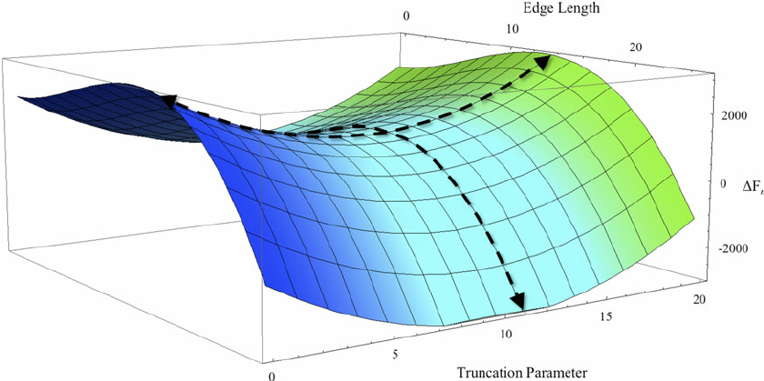

Loss Function을 살펴보면 **Geneartive model**은 loss function은 **minimize** 해야하고, **Discriminative model**은 loss function을 **maximize** 해야한다. (여기서 loss function은 오차가 아니라 정확도를 말한다.) 따라서 위와 같은 saddle point를 가지는 그래프가 나온다. 

> **GAN의 단점이 optimize 하기가 매우 어렵다.**

정말 하나의 architecture을 optimize하는 것 자체가 논문거리가 될 정도이니 말이다.

--------------

## 6. Learning Process

### 6-1. Distribution 관점

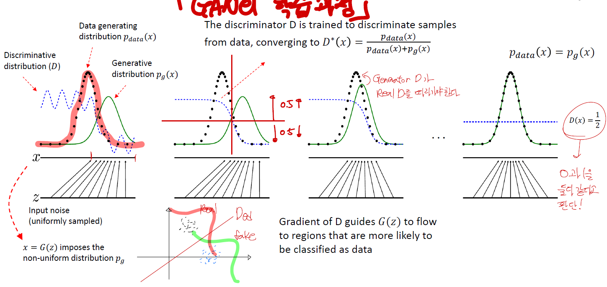

1. random noise는 uniform하게 Generative model에 넣어준다. 이 때 Generative Model은 **Neural Network**로 구성되어있다.
2. Discriminator는 $D^*(x) = \frac{P_{data}(x)}{P_{data}(x) + P_{g}(x)}$ 이다. 이 의미는 real data일 확률인지, generative model이 만들어낸 data일 확률인지 판단하는 척도이다.
3. Discriminator의 feedback으로 점점 generative model이 real model과 비슷하게 학습해나간다.
4. 만약 discriminator가 real data와 같아진다면 종료한다. 이 때 $D^*(x) = \frac{P_{data}(x)}{P_{data}(x) + P_{g}(x)}$ 는 real data일 확률과 Generative model의 data일 확률이 같은 지점, 즉 Discriminator가 구분하지 못하는 지점이므로 종료한다.

### 6-2. Neural Network 관점

1. $z$ sampling
2. Generative model : $G(z)$ --> $X'$
3. Discriminative model : $D(G(z)) = D(X')$
4. Sigmoid($D(X')$) --> 1 or 0 using Cross Entropy Error

--------------

## 7. Deep Convolutional GAN

### 7-1. Concept

1. Discriminative : Convolutional Network
2. Generative : Upsampling Network

- _**주요 기여**_ : _**즉, latent vector 안에 각각의 image들의 여러가지 성분들이 존재하고 이를 연산으로 확인하였다.**_

### 7-2. Architecture

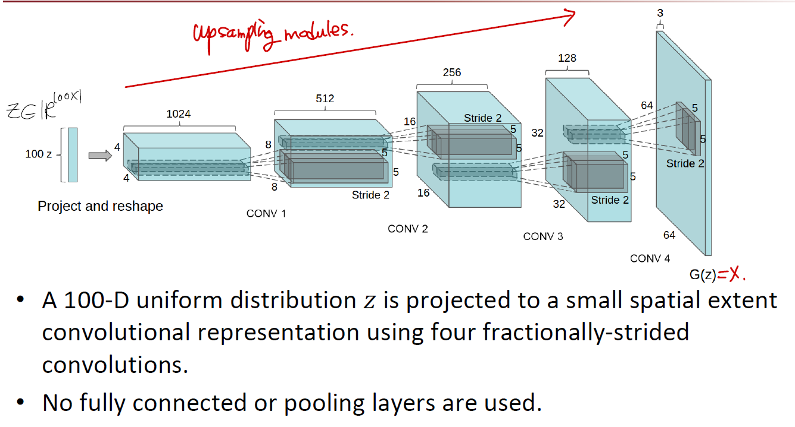

1. Pooling layer를 쓰지 않고 convolution layer : pooling 은 미분이 되지 않아 update가 안되기 때문에 convolution으로 대체
   1. discriminator : replace any pooling layer with strided convolutions
   2. generator : fractional-strided convolutions
2. Batchnorm을 discriminator, generator에 둘다 씀, generator의 output, dicrimiator의 input layer 에는 넣지 않았다.
3. Fully connected layer를 Deep한 구조를 위해 피함 : Global Average Pooling을 이용
4. generator의 모든 layer들은 ReLU, 마지막 output은 Tanh(Batch 때문에)
5. Discriminator는 모든 layer들은 LeakyReLU (-구역은 0.2)

### 7-3. Example

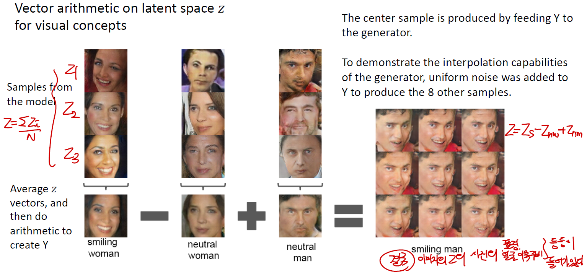

> 실제로 생성된 data들의 latent vector를 이용해서 좀 더 분석적인 data를 만들 수 있다. 

웃고 있는 여자 사진들의 latent vector를 평균, 일반적인 여자 사진들의 latent 평균, 일반적인 남자 사진들의 latent 평균들을 연산을 통해 새로운 latent vector를 만들어낸다고 가정하면,

이 때 이 새로운 vector들을 random noise를 주어 image를 생성했을 때, 실제로 웃고 있는 남자의 사진이 나왔다.

_**즉, latent vector 안에 각각의 image들의 여러가지 성분 (눈, 코, 입, 표정, 얼굴 색 등)들이 존재하고 이를 연산으로 확인할 수 있다.**_

--------------

## 8. Applications (추후에 review)

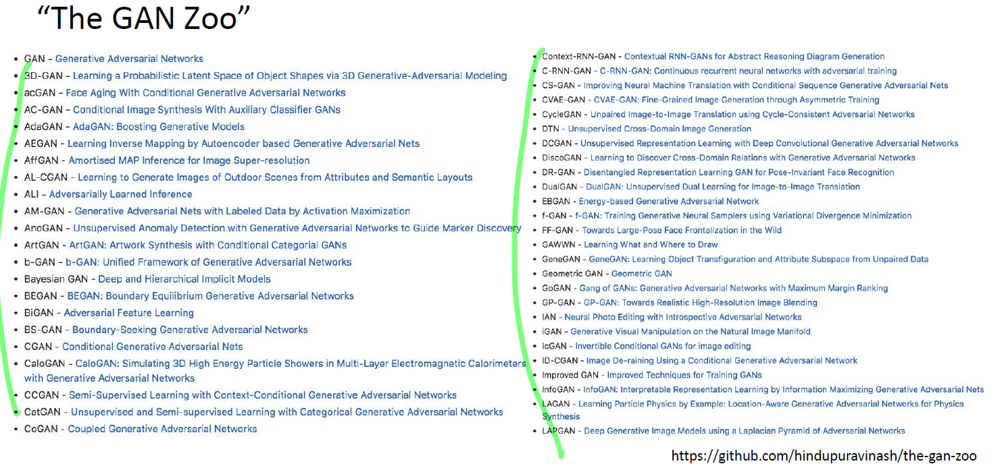

- BigGAN
- Explosion of GAN
- scene graphs to GAN

--------------

## 9. GAN Dissection (Interpret)

### 9-1. Concept

- 주요 기여도 : _**latent vector를 조절하는 것이 아니라, latent unit을 조절하여 interpreting이 가능한 모델을 만들었다.**_

### 9-2. Architecture

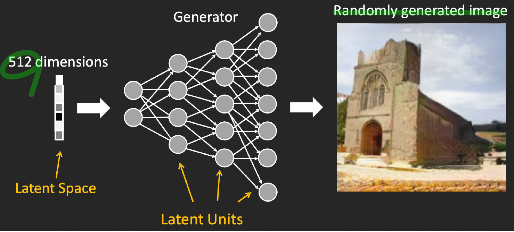

실제로 latent vector가 아닌 latent unit을 조절하여 image를 원하는 부분을 조절할 수 있다는 것이 이 논문의 핵심이다.

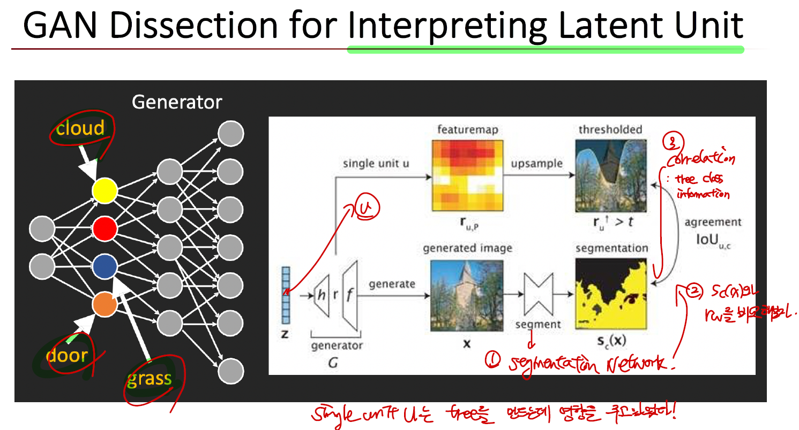

1. 학습된 generator를 이용해서 single unit u를 뽑아낸다.
2. unit u를 뽑아내서 feature map을 만든다.
3. feature map은 upsampling을 통해 thresolded를 생성한다.
4. generated image을 segmentation을 통해 upsampling한 image와 IOU로 비교한다.

### 9-3. Purpose

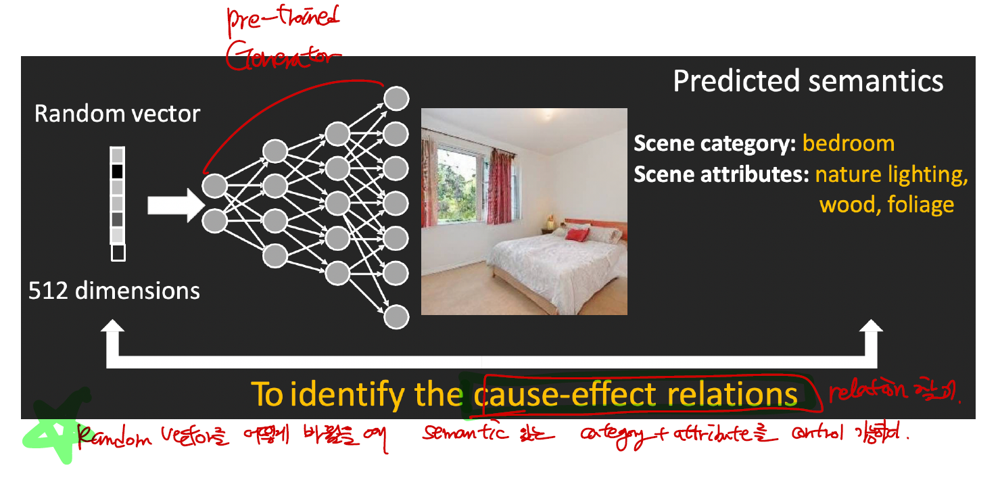
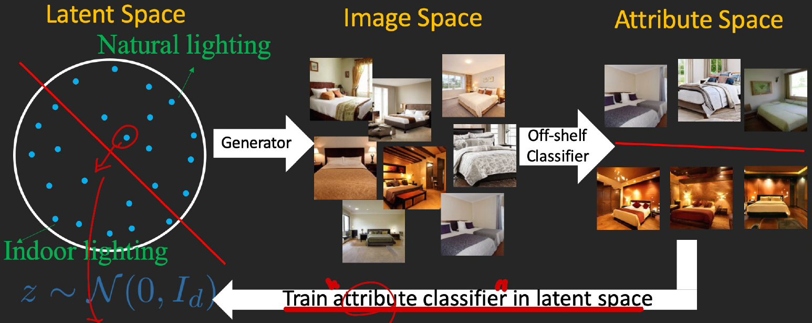

> 1. _**Random Vector & Cause-Effect Relation을 통해 Semantic 적인 부분을 해석 가능하다.**_
> 2. _**변경할 때는 큰 틀 안에서 소량만 바꿔야한다. Off-Shelf Classifier를 넘지 말아야한다.**_

--------------

## 10. GAN inversion

### 10-1. Concept

GAN을 학습하는 것은 대단히 어려운 일이다. Loss Function 자체가 Saddle Point 이기도 하고, Generator와 Discriminator 사이 학습속도도 서로 맞춰야한다.

> 따라서 generative model을 만드는 것은 어려운 일이며, _**기존에 만들어진 pre trained model을 우리가 원하는 data에 맞게 재사용하면 어떨까?**_ 라는 질문에서 출발한 것이 **GAN inversion**이다.

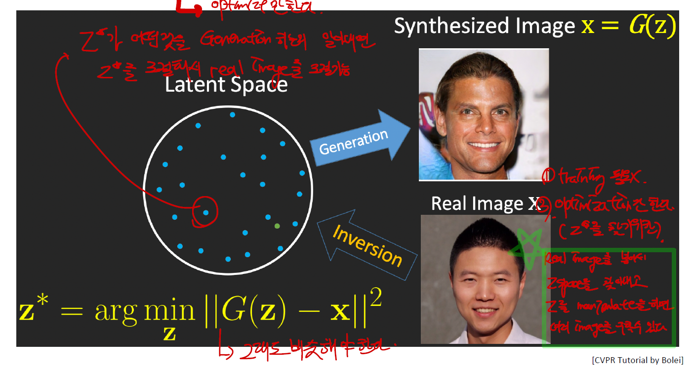

> _**실제 real image를 통해서 Z space로 근사시켜 Z'을 만들고 이 real image에 맞게 변형된 Z'을 이용하여 새로운 image를 만들 수 있다.**_ 는 것이 이 논문의 핵심이다.

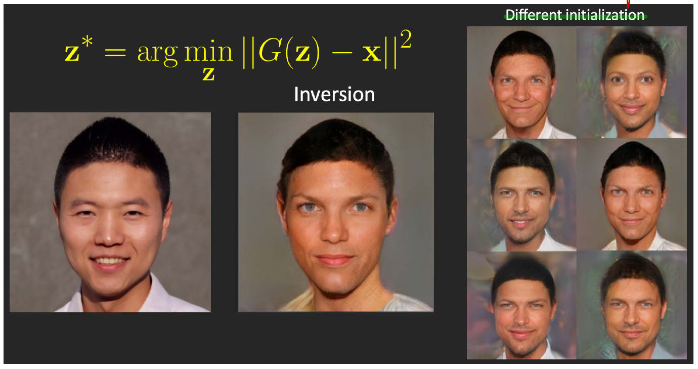

실제로 initialization을 어떻게 하느냐에 따라 생성되는 이미지도 다르다.

--------------

## GAN이 중요한 이유

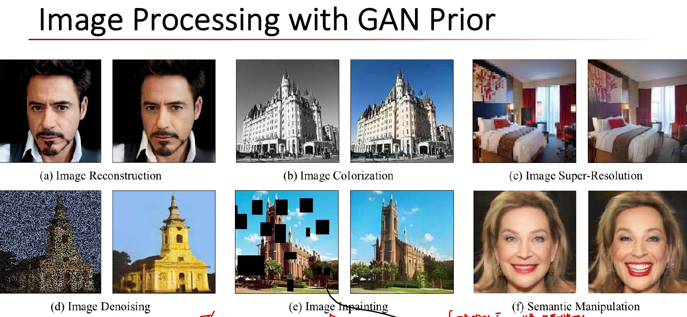

실제로 GAN은 정말 중요하다. GAN으로 미리 generator를 만들어두면 
- image reconstruction
- image colorization
- image super resolution
- image denosing
- image inpainting
- semnatic manipulation

등등 여러가지 방면으로 쓰일 수 있다.

_**이것이 가능한 이유는 pre-trained 된 generator가 있기만 하다면, 바꾸고 싶은 image를 GAN inversion을 통해 $Z'$ space를 만들면 바꾸고 싶은 image의 $Z'$ space로 image로 semantic 적인 부분까지 control하여 새로운 image를 만들 수 있다.**_

--------------

## Reference

1. [GAN 정리 쉬운 버젼](https://sensibilityit.tistory.com/505)
2. [GAN 정리 정식 버젼](http://jaejunyoo.blogspot.com/2017/01/generative-adversarial-nets-1.html)
3. [GAN 정리 이론만 정리 버젼](http://jaejunyoo.blogspot.com/2017/01/generative-adversarial-nets-2.html)
4. [DCGAN 정리](http://jaejunyoo.blogspot.com/2017/02/deep-convolutional-gan-dcgan-1.html)
5. [DCGAN 정리](https://arxiv.org/pdf/1811.10597.pdf)
