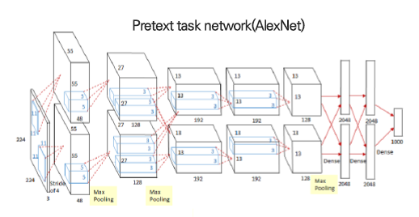
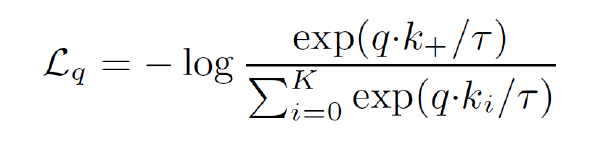

# Representation Learning

------------

## 1. Concept

> Representation Learning 이란? 유용한 정보를 뽑도록 도와주는 data를 learning 하는 작업이다.

------------

## 2. Pretext Task

### 2-1. 정의

pretext task에 대한 정의는 정말 여러가지이긴한데, 하나로 설명할 수 있다.

> 1. Pretext task란, 딥러닝 네트워크가 어떤 문제를 해결하는 과정에서 영상 내의 semantic한 정보들을 이해 할 수 있도록 (배울 수 있도록) 학습되게 하는 임의의 task. 
> 2. Pretext task는 딥러닝 네트워크가 semantic 정보를 학습하도록 사용자가 임의대로 정의하게 됨
> 3. Pretext task는 네트워크가 해결할 수 있도록 미리 설계된 작업이며 pretext task의 객관적인 기능을 학습하여 시각적 기능을 학습합니다.
> 4. _**사용자가 정의한 문제**_ (뭔가 이 정의가 확 와닿는다)

1. pretext task가 잘 짜여졌다면, input을 효과적으로 representation 할 것이라는 가정이 존재한다.
2. _**따라서 Unlabeled dataset을 input으로 받아 pretext task (사용자가 정의한 문제)를 학습하게 하여 데이터 자체에 대한 이해도를 높이고자 하였다.**_
3. _**데이터 자체에 대한 이해도가 높은 network를 transfer learning을 통해 downstream task로 해결한다.**_

### 2-2. 목적

> _**Pretext task에서 나온 pre-training 되어진 network를 궁극적으로 사용자가 풀고자 하는 문제 (downstream task, classfication or regression)에 transfer learning하는 방법.**_

### 2-3. 종류

- Exemplar
- Context Prediction (Relative Patch Location)
- Jigsaw Puzzle
- Image Colorization
- Context AutoEncoder
- Count Vector
- Rotation

pretext task를 만드는 방법은 정말 여러가지가 있지만 자세한건 논문을 찾아보자.

### 2-4. Pretext Task Network (AlexNet)

data를 온전히 이해하기 위한 pretext task network는 AlexNet으로 이루어져있다.

------------

## 4. Downstream Task Evaluation

1. 먼저 data를 온전히 이해하기 위한 pretext task network는 AlexNet으로 학습을 한다.
2. weight를 Downstream task로 내려서 freeze
3. 기존의 알려진 label dataset으로 성능을 평가한다.
   1. classification accuracy
   2. clustering evaluation (context prediction)

------------

## 5. Contrastive Learning : SimCLR

> pretext data 을 이용해서 data의 similarity을 이용하여 positive & negative를 분류하였다.

> _**하지만 positive, negative 모두 labeled 되어있는 data 이다. 우린 어떻게 이 positive, negative good sample들을 얻을 것인가?**_

### 5-1. Algorithm

1. Stochastic Data Augmentation 진행
   1. Random Cropping and Resize to original
   2. Random Color Distortion
   3. Random Gaussian Blur
2. Neural Network base encoder f 통과
3. Neural Network projection head g 로 mapping
4. Contrastive Loss Function 계산

#### 5-1.1. Stochastic Data Augmentation 진행

그림을 보면 Color와 Crop 조합이 가장 우수한 성능을 보여준다고 나와있다.

original data를 넣으면 Augmentation을 통해 data가 변이된 것이 들어간다. 따라서 서로의 상관관계를 학습하는 단계라고 볼 수 있다.

#### 5-1.2. Neural Network base encoder f 통과

f는 ResNet-50 Neural Network을 가진다.

#### 5-1.3. Neural Network projection head g 로 mapping

여기서 한 번 non-linear activation functin 을 쓴 이유는 단지 실험적인 결과에 의한 것이다.

#### 5-1.4. Contrastive Loss Function 계산

> _**같은 image에서 나온 $z_i, z_j$의 cosine similarity을 이용해서 유사도가 클수록 좋고 다른 image에서 나온 $z_i, z_j$의 cosine similarity는 작을수록 좋다.$**_

또한 negative sampling을 통해 batch 단위로 학습하여 모든 $z$간의 유사도를 구하지 않아도 된다.

### 5-2.Performance

- label data을 일부 사용하여 모델링하는 semi-supervised learning 방식의 성능을 뛰어넘었다.
- self-supervised learning 방법 중 가장 우수한 성능을 보임

------------

## 6. Contrastive Learning : MoCo

### 6-1. End to End

#### 1) 방법

End to End는 SimCLR과 비슷한 구조를 가진다. 

#### 2) 단점

1장당 1024장을 contrastive loss를 구해야 성능이 제대로 나오기 때문에, GPU memory + computation 을 많이 잡아먹는다.

### 6-2. Memory Bank

#### 1) 방법

1. memory bank를 만든다. (negative feature를 따로 만들지 말자!!) memory bank는 모든 feature들이 다 들어있는 bank다.
2. memory bank에서 instatnce agnositc (객체 무시), instance 구분 없이 feature를 sampling
3. positive queue image를 넣어서 비교한다.

#### 2) 장점

memonry bank만 update하면 bank에서 negative term들을 instance agnostic 하게 뽑을 수 있다.

#### 3) 단점

엄밀히 말하면 memory bank 에서 instance를 무시하고 sampling을 하기 떄문에 완전 Good Sample이라고 말할 수 없다.

### 6-3. MoCo (솔직히 이해 못함...)

#### 1) 특징

1. 학습된 encoder를 통해 sample을 생성
2. 큰 dictionary를 통해 많은 negative sample의 수를 확보하여 성능을 향상
3. encoder와 유사하게 학습, key들의 consistency를 최대한 맞추어 천천히 학습하게 한다.

#### 2) loss function

- NPID(memory bank 썼던 논문)에서 사용ㅎ나 loss function 사용
- q는 encoder를 거친 query, k는 dictionary에 있는 feature
- $k_+$ 가 query의 positive sample의 개념으로 볼 수 있음
- $k_+$ 을 분류하는 k+1개의 softmax과 유사한 classifier라고 저자들을 말함.

#### 3) Method-Momentum Contrast

- Dictionary as queue
  - queue 개념을 도입, 기존의 memory bank와의 차별점을 둠
  - batch size에 크게 의존하지 않게 dictionary 의 크기를 구성할 수 있음
  - Queue 구조상 가장 처음 들어온 특징벡터가 가장 먼저 나가게 되면서 consistency 유지
- Momentum Update
  - Queue 에 있는 key의 특징벡터가 consistent 하려면 기존 key가 가지는 parameter $\theta_k$ 를 많이 가져가야 한다.
  - $\theta_k$ 는 실험적으로 0.999 일 때 가장 학습이 안정적이고 우수한 성능 (사실 있으나 마나 한 느낌이긴 하다...)
  - $\theta_k ← m \theta_k + (1-m_)\theta_q$

------------

## Reference

1. [Paper : SimCLR](https://arxiv.org/pdf/2002.05709.pdf)Chen et al., “A Simple Framework for Contrastive Learning of Visual Representations,” ICML, 2020
2. [Paper : Exemplar](https://arxiv.org/abs/1406.6909) : Dosovitskiy et al., “Discriminative Unsupervised Feature Learning with Exemplar Convolutional Neural Networks,” NIPS, 2014
3. [Paper : Context Prediction (Relative Patch Location)](https://arxiv.org/abs/1505.05192) : Doersch et al., “Unsupervised Visual Representation Learning by Context Prediction,” ICCV, 2015
4. [Paper : Jigsaw Puzzle](https://arxiv.org/abs/1603.09246) : Norrozi et al., “Unsupervised Learning of Visual Representations by Solving Jigsaw Puzzles,” ECCV, 2016
5. [Paper : Image Colorization](https://arxiv.org/abs/1603.08511) : Colorful Image Colorization
6. [Paper : Context AutoEncoder](https://arxiv.org/abs/1604.07379) : Context Encoders: Feature Learning by Inpainting
7. [Paper : Count Vector](https://arxiv.org/abs/1708.06734) : Representation Learning by Learning to Count
8.  [Paper : Rotation](https://arxiv.org/abs/1803.07728) : Gidaris et al., “Unsupervised Representation Learning by Predicting Image Rotations,” ICLR, 2018
9.  [Self-Supervised Learning 정리 잘해둠](http://dmqm.korea.ac.kr/activity/seminar/302)